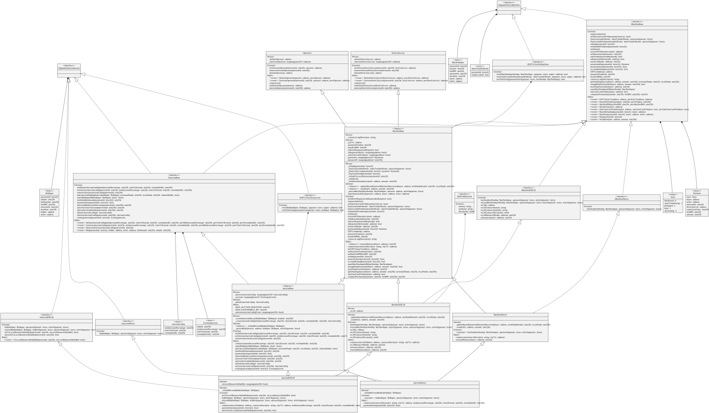

# Escrow Contracts for Payments in Auction & BuyNow modes

## Install and tests
```
npm ci 
npm test
```

## Description

This repository contains the Solidity contracts that implement an Escrow mechanism to conduct payments for assets in Auction and BuyNow modes. The following are the 2 main contracts that can be deployed independently for this purpose:

1. `AuctionNative.sol` - for both Auctions and BuyNows in the native cryptocurrency of the blockchain of deployment,
1. `AuctionERC20.sol` - for both Auctions and BuyNows in the ERC20 tokens whose contract address is specified on deploy.

Both inherit from the BuyNow-only versions, which are based on previously audited code, and which can also be deployed independently:

1. `BuyNowNative.sol` - a base version of `AuctionNative.sol` that only operates BuyNows,
1. `BuyNowERC20.sol` - a base version of `AuctionERC20.sol` that only operates BuyNows.

The Auction contracts inherit from the BuyNow contracts, extending the functionality to enable Auctions, while re-using all stages of the State Machine after `ASSET_TRANSFERRING`.

Buyers/bidders provide explicit signatures agreeing to let a specified `Operator` address act as an Oracle, and be responsible for signing the success or failure of the asset transfer, which is conducted outside this contract upon reception of funds. This external process is typically associated to a defined layer-2 flow and governance. On start of any payment, signatures of both the buyer/bidder and the Operator are required and verified. Seller signatures are also provided, showing agreement to list the asset as ruled by every explicit paymentId.

If no confirmation is received from the Operator during the defined `PaymentWindow`, all funds received from the buyer are made available to him/her for refund. Throughout the contracts, this moment is labeled as `expirationTime`.


## Auction & BuyNow modes

BuyNow transfers are simple: the first buyer to pay acquires the asset.

Auctions start with an initial bid, and an initial `endsAt` time, and are characterized by: `minIncreasePercentage, timeToExtend, extendableUntil` as follows: 
- New bids need to provide and increase over the previous highest bid by a percentage of at least `minIncreasePercentage`;
- 'Late bids', defined as those that arrive during the time window `[endsAt - timeToExtend, endsAt]`, increment `endsAt` by an amount equal to `timeToExtend`, with max accumulated extension capped by `extendableUntil`.

## Local vs External Funds

The contracts maintain the local balances of all users, which can be withdrawn via explicit calls to the various 'withdraw' methods. If a buyer has a non-zero local balance at the moment of executing a new bid/buyNow, the contracts reuse it, and only require the provision of the remainder (if any) funds.

In the ERC20 case, to improve user UX, the default settings are such that when a bidder is outbid by a different user, he/she is automatically refunded to the external ERC20 (as opposite to refunding to this contract's local balance). Accepting a new bid and transferring funds to the previous bidder in the same TX is a safe operation with ERC20 tokens, because the ERC20 contracts accepted have been previously reviewed for absence of malicious `transfer` implementations. 

On the contrary, Native Crypto flows do not accept this feature, and outbids always refund to previous bidders' local balance, requiring explicit withdrawals. This is a standard security pattern due to the fact that the external address could contain malicious implementations on arrival of new funds.

## Payments Flow

All Auctions/BuyNows are uniquely identified by a `(bytes32) paymentId` generated from a sufficiently large source of entropy (typically, by hashing various entities that include at least one random number). The following diagram shows the State Machine of any Auction/BuyNow:


These are the possible states and their transitions:

- `NOT_STARTED` -> `ASSET_TRANSFERRING`, triggered by `buyNow`,
- `NOT_STARTED` -> `AUCTIONING`, triggered by `bid`,
- `AUCTIONING` -> `AUCTIONING`, triggered by successive bids,
- `AUCTIONING` -> `ASSET_TRANSFERRING`, triggered when `block.timestamp > endsAt`; in this case, this transition is an implicit one, reflected by the change in the return state of the `paymentState` method,
- `ASSET_TRANSFERRING` -> `PAID`, triggered by `finalize`, relaying assetTransferSuccess signed by Operator,
- `ASSET_TRANSFERRING` -> `REFUNDED`, triggered by `finalize`, relaying assetTransferFailed signed by Operator,
- `ASSET_TRANSFERRING` -> `REFUNDED`, triggered by `refund` after expirationTime.

## Relayed Payments in ERC20 flows

For ERC20 flows, the user must first allow this payment contract to receive funds, as mandatory by the ERC20 standard. This can be done only once, by providing a large allowance (which is not restricted to be below the user's current balance), or once per payment.

Once the allowance step is cleared, there are two different flavours of the `bid/buyNow` methods to get to the same place: direct and relayed:
- in the `bid/buyNow` methods, the buyer is the `msg.sender` (the buyer therefore signs the TX), and the Operator's EIP712-signature of the `bid/buyNow` parameters is provided as input to the call;
- in the `relayedBid/relayedBuyNow` methods, anyone can be `msg.sender`, but both the operator and the buyer's EIP712-signatures of the `bid/buyNow` parameters are provided as input to the call.

In all cases, the seller signature is also provided; in the case of auctions, such signature is only verified upon arrival of the first bid, to avoid unnecessary gas costs.

## UML Diagram



## Generating ABI

`solc --version`
> solc, the solidity compiler commandline interface
> Version: 0.8.14+commit.80d49f37.Linux.g++

`abigen --version`
> abigen version 1.10.25-stable-69568c55

From root folder execute:

```
solc --include-path node_modules/ --base-path . --abi ./contracts/buyNow/BuyNowERC20.sol -o ./out
abigen --abi=./out/IBuyNowERC20.abi --out=BuyNowERC20.go --pkg=buynowserc20
```

Notes: Older abigen versions might produce a bad golang file